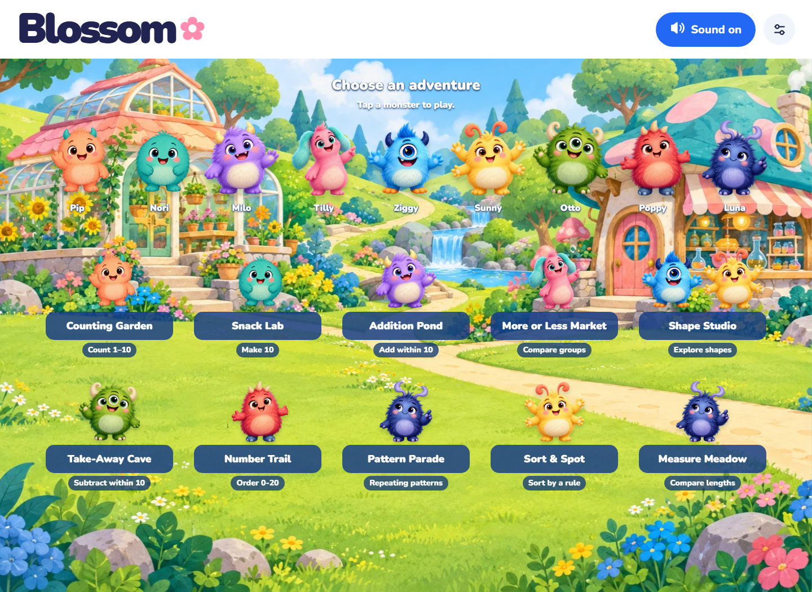

# Blossom 🌸

A friendly kindergarten math town with **10 playable games and 9 original monster friends**. Every game has a short narrated animated lesson, visual hints, gentle retry feedback, and five-round independent practice. Emma's British English voice is bundled with the app.

**[Play Blossom](https://blossom-math-town.alx21.chatgpt.site/)** · **[GitHub browser demo](https://agammann.github.io/blossom-math-town/)** · **[Android APK and source downloads](https://github.com/agammann/blossom-math-town/releases/latest)**



## Games

| Game | Friend | Kindergarten skill |
| --- | --- | --- |
| Counting Garden | Pip | Count objects from 1 to 10 |
| Snack Lab | Nori | Complete a ten-frame; make 10 |
| Addition Pond | Milo | Join two groups; add within 10, including zero |
| More or Less Market | Tilly | More, fewer, and equal groups from 0 to 10 |
| Shape Studio | Ziggy & Sunny | Circles, triangles, squares, and long rectangles |
| Take-Away Cave | Otto | Take away and subtract within 10 |
| Number Trail | Poppy | Missing numbers in order from 0 to 20 |
| Pattern Parade | Luna | Repeating AB, AAB, ABB, and ABC patterns |
| Sort & Spot | Sunny | Sort objects by colour, shape, or size |
| Measure Meadow | Luna | Compare longer, shorter, and equal lengths |

The game checks are deterministic. A picture never becomes correct because of a language-model response. This is a first kindergarten prototype, not a full curriculum or assessment system.

## Run locally

Install **Node.js 22 or newer** (with npm), then:

```sh
git clone https://github.com/agammann/blossom-math-town.git
cd blossom-math-town
npm ci
npm start
```

Open **http://127.0.0.1:4173**. The browser game itself has no JavaScript package dependencies; npm installs the tools for the Android project. You can also run `node scripts/serve.mjs web` directly without installing packages if you only want browser play.

```sh
npm test           # math boundary cases and all bundled voice assets
npm run build      # portable static website in dist/
npm run preview    # serve the built website at the same local address
```

Upload the contents of `dist/` to a static web host to share your own browser version. Hash routes work on simple hosts. Use an HTTP server rather than double-clicking `index.html`, because the app uses JavaScript modules. Stop the server with Ctrl+C.

## Android Studio

The `android/` directory is a real Capacitor Android Studio project, not a link to the hosted website. It packages the same ten games, artwork, fonts, and all 404 voice clips locally.

Requirements: Android Studio, **Java/JDK 21**, Android SDK **platform 36**, and the SDK build tools. Minimum Android version is **7.0 / API 24**. The included Gradle wrapper uses Gradle 8.14.3. Set Android Studio's **Gradle JDK to Java 21**, particularly if your Studio installation bundles Java 25.

```sh
npm ci
npm run android:sync
npm run android:open
```

In Android Studio, let Gradle sync, select a device or emulator, and press Run. To produce an APK from the command line after syncing:

```sh
# macOS / Linux
cd android
./gradlew assembleDebug
```

```powershell
# Windows PowerShell
cd android
.\gradlew.bat assembleDebug
```

The APK is at `android/app/build/outputs/apk/debug/app-debug.apk`. If Gradle cannot find the SDK, set `ANDROID_HOME` or let Android Studio create its local `local.properties`. After any edit to `web/`, run `npm run android:sync` again before building.

The downloadable APK is **debug-signed for testing**, not a Play Store release. A production release needs your own signing key and normal store preparation. Keep signing keys out of Git. Android browser behavior can vary with the installed Android System WebView.

## Play and accessibility

- Choose a game, watch its lesson, or press **My turn**.
- Tap or click objects and answers. Keyboard users can Tab to a control and press Enter or Space. No dragging is required.
- **Show a hint**, **Start over**, **Hear again**, **Town**, and browser Back all work.
- **Sound off** stops narration immediately. Captions and visual hints remain available when audio is muted, blocked, or unavailable.
- **Calm motion** and the device's reduced-motion preference suppress decorative animation.
- Completing five rounds offers a new set with **Play again**. Progress lasts only in the current tab/session.

## Privacy and offline use

No accounts, names, child profiles, chat, ads, analytics, cloud progress, or paid voice APIs. The browser version requests only its own static files. Your web host may have normal server access logs; Blossom adds no tracking code.

All speech is prerecorded synthetic narration from the free **Kokoro Emma (`bf_emma`) British English voice**, using original lesson dialogue and gentle pacing. No model runs in the game and no text is sent to a voice service. The lessons are animated explainers, rather than filmed videos. The monsters do not imitate any television character.

The Android build and locally served build include all assets and work without an internet connection after setup. The hosted browser demo still needs a connection to load files; there is currently no service worker or guaranteed offline browser cache. There is no persistent score or save system.

## Verification

Automated checks cover exhaustive arithmetic and comparisons, 0–20 number-trail coverage, pattern rules, complete sorting selections, all 404 voice files, and all nine teacher images. Browser testing covers all ten games on desktop and mobile widths, wrong-answer retries, hints/reset, five-round completion, replay, cancellation, keyboard/tap controls, and image/audio loading. See [verification details](docs/VERIFICATION.md).

The Android debug APK was built successfully and tested in an Android 16 / API 36 emulator with airplane mode enabled. All ten games completed five practice rounds, all 404 voice clips loaded and decoded offline, real narration/mute worked, and native Back/background cancellation passed. Physical phones and tablets have not yet been tested. This is a tested prototype, not a store release.

## Project layout

```text
web/                  Canonical browser source, images, font and narration
scripts/              Dependency-free local server and static build
tests/                Node math and media verification
android/              Android Studio project and Gradle wrapper
capacitor.config.json Shared Android app configuration
docs/                 Screenshots and verification notes
```

Code and original Blossom illustrations are offered under the [MIT license](LICENSE). Nunito, Kokoro, Capacitor, and Android dependencies retain their own licenses; see [THIRD_PARTY_NOTICES.md](THIRD_PARTY_NOTICES.md) and the notices bundled with the assets. Contributions that keep the app child-friendly, accessible, deterministic, and free of tracking are welcome.
